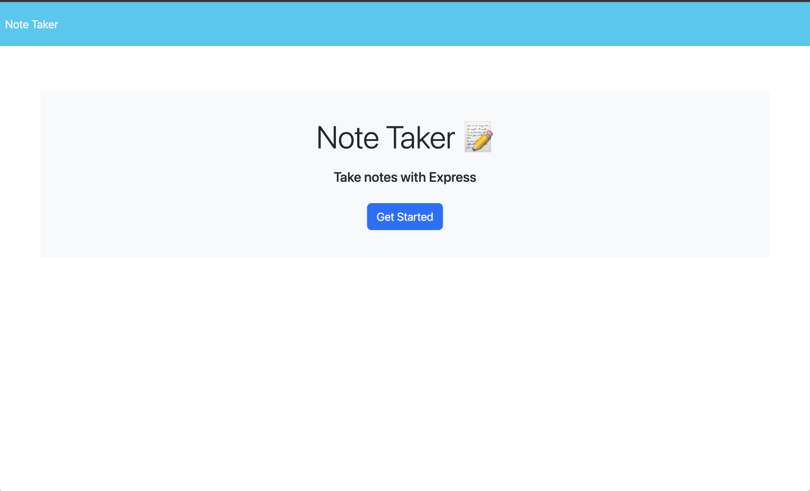
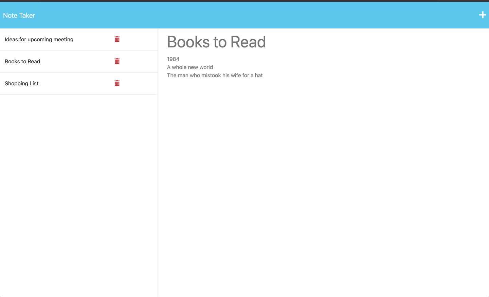

# Note Taker

## Description

This is a straightforward note-keeping application enabling users to craft, store, and remove notes. The application offers a user-friendly interface for composing, observing, and handling notes, meeting all the specified user needs and acceptance standards.

## Table of Contents

* [Installation](#installation)
* [Usage](#usage)
* [Contributing](#contribution)
* [Credits](#credits)
* [Features](#features)
* [Test](#tests)
* [License](#license)
* [Questions](#questions)

## Installation

N/A

## Usage

Click on the provided Heroku link to open the application: [Note Taker](https://notes-take-1152aec0eda6.herokuapp.com/).

### To use the Note Taker application:
1. Access the application via the provided Heroku link.
2. This will take you to the landing page. From there, select the link to go to the notes section.
3. In the notes section, you are shown a page with existing notes displayed in the column on the left.
4. Select any note from this list to view its details.
5. To add a new note, tap the plus icon located in the top navigation.
6. Fill in the note's title and body.
7. To save your note, hit the Save icon that appears.

### Demo
A preview of the website:

## Contribution

Contributions, problems, and suggestions for features are encouraged!

## Credits

https://github.com/coding-boot-camp/miniature-eureka
 This is the website to the original repository.

https://nodejs.org/
 Serves as the official documentation for Node.js.

https://expressjs.com/
 Serves as the official documentation for Express.js routing.

https://www.npmjs.com/package/uuid
 Serves as the documentation for the UUID NPM package.

## Tests
N/A

## License

This project is licensed under the MIT license.

For more information see [this link](https://opensource.org/licenses/MIT).

## Questions

- GitHub: Please visit my GitHub profile:
[carlos-2mm](https://github.com/carlos-2mm)
- Email: For clarifications or questions about this project, please send an email to:
 cimm21187@gmail.com